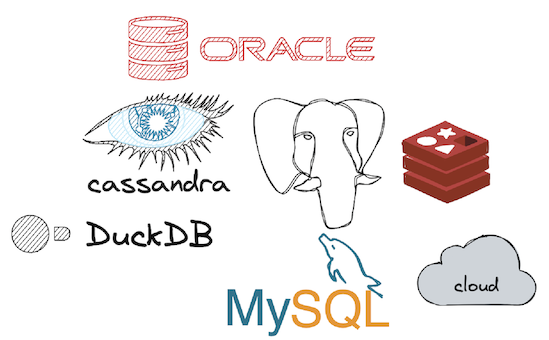
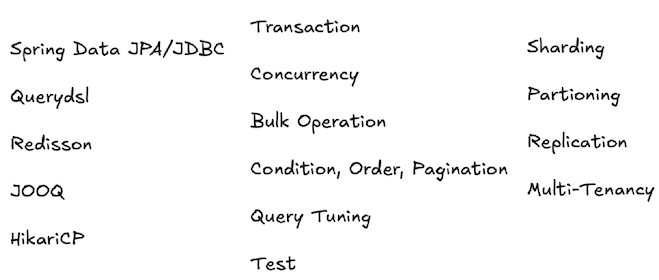

## database-ninja 🥷?

세상에는 데이터베이스 유형, 데이터 구조, 운영 환경 등에 따라 데이터베이스가 다양하게 존재한다

그리고 데이터베이스와 상호작용하기 위한 여러가지의 기술들이 있으며 각 기술들마다 목적과 특징, 사용법이 다르다

프로젝트의 요구사항 및 기타 환경을 고려하여 적절한 데이터베이스와 기술을 선택하고 원활하게 다룰 수 있는 경지에 이르고자 수련하는게 이 레포의 목적이다

데이터베이스 유형별/기술 스택별로 crud, 성능 측정 및 튜닝, 트랜잭션 관리, 정렬/페이징, 벌크 연산, 테스트, 동시성 제어 등을 실습한다

샤딩/파티셔닝, 레플리케이션은 별도의 디렉토리에서 연습해본다

#### 목차

관계형 데이터베이스
- [스프링 데이터 JPA + QueryDSL](./docs)

JPA
- [엔티티 매니저 (영속성 컨텍스트)](./docs/JPA%20-%20엔티티%20매니저%20(영속성%20컨텍스트).md)
- [엔티티 ID 전략](./docs/JPA%20엔티티%20-%20ID%20전략.md)
- [N+1 문제](./docs/JPA%20엔티티%20-%20N+1%20문제.md)
- [연관 관계](./docs/JPA%20엔티티%20-%20연관관계.md)
- [@DataJpaTest, @Sql](./docs/테스트%20-%20@DataJpaTest,%20@Sql.md)

스프링
- [@Transactional](./docs/스프링%20-%20@Transactional.md)
- [테스트 @Transactional](./docs/테스트%20-%20@Transactional.md)

테스트
- [testcontainers](https://github.com/hansanhha/kick-the-testcontainers)

## 기술 스택

데이터베이스
- PostgreSQL
- MongoDB, 
- Redis, H2 등

언어/프레임워크
- Java 21, 
- Spring Boot 3.5.x
- Spring Data JPA
- Spring Data JDBC
- Spring Data Mongo
- Spring Data Redis
- Querydsl, Redisson 등

테스트/빌드 도구
- Gradle
- Docker
- TestContainers

## 알아둬야 할 개념들

**DB 설정 및 구성**: 프로파일, 커넥션 풀, 프로퍼티 설정

**RDB, NoSQL, 인메모리 DB 사용**
- 각 데이터베이스의 구조와 특징 이해 및 선택 가이드
- 데이터 모델링: 정규화, 엔티티 설계, 적절한 컬럼 자료형 선택
- PostgreSQL, MongoDB, Redis
- 사용 기술: Spring Data JPA/JDBC/Mongo/Redis, Querydsl, Redisson

**성능 측정 및 쿼리 튜닝**
- 로그 추적
- 인덱스 전략
- N+1 문제, 인덱스 미사용, 병목 쿼리 해결
- 커버링 인덱스 설계
- 진단 도구 활용 (EXPLAIN , 슬로우 쿼리 로그, 마이크로미터, APM 등)

**벌크 연산**: JPA, JDBC, Querydsl 배치 쿼리

**트랜잭션 관리**
- 트랜잭션 전파
- 롤백 전략
- 중첩 트랜잭션

**동적 조건, 정렬, 페이징**
- Querydsl 동적 조건 구현
- 정렬 우선순위 다단계 지원
- 정렬 조건별 Index hit 여부 체크 (DB 로그 분석)

**동시성 제어**
- 비관적 락: 블로킹 테스트, 데드락 해결, 성능 이슈 체크
- 낙관적 락: 충돌 발생 후 재시도 전략
- 락 관련 SQL 로그 확인
- 분산 락: 레디스 분산 락

**테스트**
- @DataJpaTest, TestContainers, @Transactional
- 트랜잭션 롤백 여부 확인, 예외 발생 시 DB 상태 확인
- 테스트 데이터 관리 (@Sql)
- CI 환경에서 컨테이너 기반 테스트
- 테스트 DB와 실제 DB 스키마 자동 비교 (Flyway 검사)

**레플리케이션**
- 읽기/쓰기 분리 구조 (Read Replica, Write Master)
- AbstractRoutingDataSource를 활용한 DB 라우팅
- Lazy Replication 지연 이슈 (replica lag) 검출 및 대비
- 장애 시 failover 테스트
- 읽기 요청 시 replica DB 사용 → 일시적 오염 여부 테스트

**샤딩/파티셔닝**
- 샤딩: 샤딩 미들웨어(ShardingSphere, Vitess 등) 실습, 샤딩 키 전략(Snowflake, UUID, 세그먼트)
- 파티셔닝: RDB 파티셔닝 DDL 작성 → 성능 테스트, 파티션 테이블 인덱스 전략, 파티션 유지/교체 전략