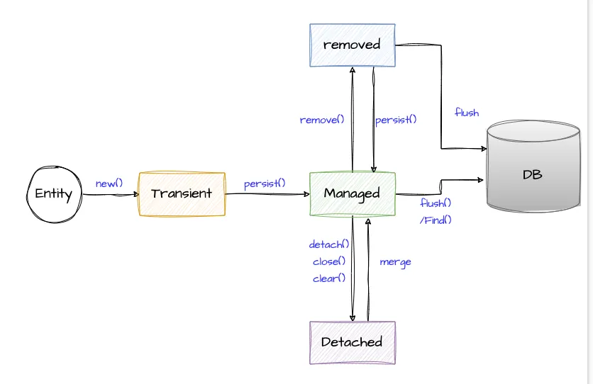

[영속성 컨텍스트](#영속성-컨텍스트)

[엔티티 매니저 주입부터 @Transactional 메서드 호출, 트랜잭션 커밋까지의 여정](#엔티티-매니저-주입부터-transactional-메서드-호출-트랜잭션-커밋까지의-여정)

[@PersistenceContext, @PersistenceUnit](#persistencecontext-persistenceunit)


## 영속성 컨텍스트

[영속성에 대한 위키백과 문서](https://en.wikipedia.org/wiki/Persistence_(computer_science))

[영속성 컨텍스트 설명 블로그](https://www.baeldung.com/jpa-hibernate-persistence-context)

[테스트 코드](../entity-manager/src/test/java/db/ninja/PersistenceStateTest.java)

백엔드나 컴퓨터 과학을 학습하다보면 **영속(Persistence)** 이라는 단어를 줄곧 접하게 된다

영속 또는 영속성이란 단어의 의미는 영원히 계속되는 성질이나 능력을 의미한다

컴퓨터 과학에서의 영속은 프로세스가 만든 데이터를 데이터 스토리지에 저장하여 프로세스가 종료된 후에도 유지할 수 있게 하며, 프로세스와 스토리지 장치 간에 각각의 자료구조(객체, 레코드 등)로 매핑하여 데이터를 이동하는 것을 말한다 

이런 영속성 구현은 직교적 영속성과 비직교적 영속성이라는 두 가지 방법으로 구현할 수 있다
- 직교적 영속성(Orthogonal, Transparent)은 영속성이 실행 환경의 기본 특성으로 제공되어 개발자가 명시적으로 저장하거나 불러올 필요가 없는 것을 의미한다
- 비직교적 영속성(Non-Orthogonal)은 데이터를 저장하거나 불러올 때 코드로 명시적인 명령을 작성해야 하는 것을 말한다
- 즉 SQL을 써서 DB에 저장하고 꺼내는 방식이 비직교적 영속성이며 JPA는 이에 해당하여 엔티티 매니저의 메서드를 통해 영속성 컨텍스트에 엔티티를 저장하거나 불러오는 방식으로 동작한다

**영속성 컨텍스트**는 자바 프로그램의 데이터를 영속화하기 위해 자바(JPA)와 데이터베이스 간의 매핑을 관리하는 메모리 공간이다

데이터베이스 접근 비용이 크기 때문에 이를 최적화하고자 프로그램과 DB 사이에 **캐시 역할**을 하는 중간 계층을 두고 데이터베이스로부터 찾아온 데이터나 저장할 데이터를 관리한다

영속성 컨텍스트가 관리하는 데이터를 **엔티티**라고 부르며 이러한 엔티티를 조회, 변경, 삭제할 수 있는 기능을 제공한다 

**엔티티 매니저**는 영속성 컨텍스트와 상호작용할 수 있는 JPA의 인터페이스로, 내부적으로 영속성 컨텍스트를 사용하여 엔티티를 관리한다

영속성 컨텍스트의 가장 중요한 역할은 데이터베이스 접근을 최소화하는 것이다. 이를 위해 1차 캐시, 엔티티 동일성 보장, 쓰기 지연, 변경 감지, 플러시 등의 기능을 제공한다

**1차 캐시**란 DB에 조회했거나 저장할 객체들을 모아두는 장소로 엔티티를 조회(find, getReference)하면 DB로 바로 접근하는 것이 아니라 영속성 컨텍스트의 캐시를 확인한다

만약 캐시에 없다면 DB에서 엔티티를 조회하고 영속성 컨텍스트에 저장한 후 반환한다. 이후 동일한 ID로 조회하면 영속성 컨텍스트의 캐시에서 엔티티를 반환한다

이는 영속성 컨텍스트가 동일한 트랜잭션 내에서 ID를 기반으로 엔티티를 추적하여 엔티티의 동일성을 보장하기 때문이다 (**엔티티 동일성(Identity) 보장**)

영속성 컨텍스트는 엔티티 매니저의 엔티티 조작(persist, remove 등) 메서드를 호출해도 즉각 DB에 반영하지 않고 내부 쿼리 저장소에 모아둔 다음, 트랜잭션의 커밋 또는 flush 시점에 한 번에 쿼리를 실행하는 특징을 가진다 (**쓰기 지연 (Write-Behind, Delayed-Write)**)

쓰기 지연은 성능 최적화에 도움을 주지만 플러시 타이밍을 잘못 관리하면 예상치 못한 DB 반영이 일어날 수 있다는 것을 유의해야 한다

영속성 컨텍스트는 엔티티의 동일성을 보장함과 동시에 **엔티티에 대한 스냅샷**을 남겨 엔티티의 변경 사항도 추적한다. 따라서 영속성 컨텍스트에 저장된 엔티티(영속 상태)의 변경된 필드가 트랜잭션 커밋 시점에 자동으로 감지되며 이에 대한 update 쿼리가 생성된다 (**변경 감지 (Dirty Checking)**)

영속성 컨텍스트가 DB에 변경 사항을 반영하는 시점을 **플러시(flush)**라고 하는데, 플러시는 `EntityManager.flush()`, 트랜잭션 커밋 시점이나 JPQL 실행 직전에 발생한다. 참고로 플러시를 해도 트랜잭션을 커밋하지 않으면 DB에 임시 반영 상태로만 존재한다

엔티티는 아래의 이미지와 같이 영속성 컨텍스트에 의해 관리되는 상태를 가진다 [이미지 출처](https://medium.com/javarevisited/spring-data-jpa-entity-lifecycle-model-c67fdae2d0c2)



NEW 상태는 새로 생성된 객체(엔티티)이며 아직 영속성 컨텍스트에 등록되지 않은 비영속 상태를 의미한다

MANAGED 상태는 find로 데이터베이스에서 불러오거나 persist를 호출하여 영속성 컨텍스트에 의해 관리되는 영속 상태를 의미한다 (persist는 엔티티를 영속성 컨텍스트에 등록하여 MANAGED 상태로 전이시키는 메서드로 이 시점에는 INSERT 쿼리가 나가지 않음)

DETACHED 상태는 clear, detach, close 등의 메서드로 영속성 컨텍스트로부터 분리된 상태를 의미하는데, 이 상태에 놓이면 위에서 언급한 영속성 컨텍스트의 기능을 사용할 수 없게 된다

REMOVED 상태는 remove 메서드로 데이터베이스에 삭제될 예정인 상태를 의미한다

엔티티 매니저의 `persist`, `merge`, `remove`, `detach`, `clear` 등의 메서드를 통해 엔티티의 상태를 변경할 수 있다

일반적으로 트랜잭션 범위 내에선 NEW 또는 MANAGED, REMOVED 상태로만 전이되며, 트랜잭션이 종료된 상태에서 엔티티를 사용하면 DETACHED 상태가 된다

```java
// 영속성 컨텍스트에 의해 관리되는 상태 (MANAGED)
User user = em.find(User.class, 1L); 

// 영속성 컨텍스트에서 분리한다 (DETACHED)
em.detach(user);

// 영속성 컨텍스트를 비운다 (모든 엔티티가 DETACHED 상태로 전이됨)
em.clear();
```

DETACHED 상태가 되면 엔티티가 메모리에 존재하지만 엔티티 매니저가 관리하지 않기 때문에 변경 감지, 플러시, 쿼리 생성, 1차 캐시, 지연 로딩 대상에서 제외된다

즉, 자바 객체로서의 상태를 변경하는 것은 가능하지만 영속성 컨텍스트에서 이를 추적하지 않기 때문에 DB에 반영되지 않는다

따라서 트랜잭션 내부에서만 엔티티를 조작하고 외부 계층에 전달하려면 DTO를 사용하는 것이 안전하다

```java
@Transactional
public User loadAndReturnUser() {
    // 트랜잭션 범위이므로 엔티티는 MANAGED가 된다
    return userRepository.findById(1L).orElseThrow(); 
}

/*
   다른 서비스나 컨트롤러에서 User 엔티티를 받아 변경한다
   이 User 엔티티는 트랜잭션 범위 밖에서 아용되므로 영속성 컨텍스트에 포함되지 않는다 (DETACHED 상태) 
   따라서 여기서 발생한 변경사항은 감지되지 않고 update 쿼리가 생성되지 않는다     
*/
public void updateName(User user) {
    user.setName("changed");
}
```

em.merge 메서드는 DETACHED 상태의 엔티티를 영속성 컨텍스트에 다시 연결하여 MANAGED 상태로 전이시키는 역할을 한다

em.merge 메서드의 동작은 다음과 같다
- 인자로 받은 DETACHED 엔티티의 식별자를 기준으로 현재 영속성 컨텍스트에 동일한 식별자를 가진 MANAGED 엔티티가 있는지 확인한다
- 있으면 그 영속 엔티티에 DETACHED 엔티티의 필드 값을 복사하여 업데이트한다 (덮어쓰기)
- 없으면 DB에서 조회한 다음 새로운 MANAGED 엔티티를 생성하고, DETACHED 엔티티의 필드 값을 복사하여 업데이트한다
- 그 다음 새로 생성한 MANAGED 엔티티를 반환하며 인자로 받은 DETACHED 객체는 여전히 DETACHED 상태로 남아있다

[테스트 코드](../entity-manager/src/test/java/db/ninja/PersistenceStateTest.java)

여기서 포인트는 merge를 하게 되면 해당 엔티티의 값으로 모든 값을 덮어쓴다는 것이다

실제로 엔티티 매니저 API를 호출하는 일은 드물겠지만 리포지토리 인터페이스를 사용하면 그 구현체인 SimpleJpaRepository의 `save(<T> entity)` 메서드에서 `entityManager.merge()`를 호출하게 된다

save 메서드의 `entityInformation.isNew(entity)`는 엔티티의 ID가 null이거나 0인 경우 새 엔티티로 판단한다

만약 영속 상태인 엔티티를 save 메서드로 전달하면 리포지토리 인터페이스는 기존 엔티티로 판단하고 merge를 호출하여 모든 필드 값을 덮어쓰게 된다

따라서 영속 상태의 엔티티를 save 메서드로 전달하는 것보다 변경 감지를 활용하는 방법이 더 안전하다

```java
@Transactional
public <S extends T> S save(S entity) {
    if (entityInformation.isNew(entity)) {
        entityManager.persist(entity);
        return entity;
    } 
    // 기존 엔티티인 경우 merge를 호출하여 모든 필드 값을 덮어쓴다
    else {
        return entityManager.merge(entity);
    }
}
```

영속성 컨텍스트의 범위는 트랜잭션의 제한 여부에 따라 달라진다

트랜잭션이 시작과 종료에 맞춰 생성 및 소멸되는 영속성 컨텍스트를 **트랜잭션 스코프 영속성 컨텍스트 (Transaction-scoped persistence context)**라고 한다

반면 트랜잭션이 없어도 유지되는 영속성 컨텍스트인 **확장 영속성 컨텍스트 (Extended persistence context)**는 여러 트랜잭션 동안 같은 컨텍스트를 공유할 수 있다 (플러시하려면 트랜잭션이 필요함)

여러가지 이유로 인해 스프링에선 기본적으로 트랜잭션 스코프를 사용(엔티티 매니저는 트랜잭션 범위 내에서만 사용)하고 확장 스코프를 거의 사용하지 않는다

스프링은 **무상태(stateless)**를 지향하여 각 요청에 독립적인 빈, 트랜잭션, 영속성 컨텍스트를 생성하고 처리한다 (싱글톤)

확장 스코프는 한 번 생성된 엔티티 매니저와 영속성 컨텍스트를 특정 세션에 걸쳐 오래 유지해야 하므로 상태를 가진 컴포넌트(stateful bean)를 필요로 하고 데이터베이스 커넥션을 낭비하게 된다

또한 트랜잭션 스코프는 @Transactional로 명확한 경계를 지을 수 있지만 확장 스코프는 하나의 영속성 컨텍스트가 여러 트랜잭션에 걸쳐 사용될 수 있으므로 트랜잭션 상태 추적이 어렵고 데이터 정합성(데이터가 일관된 상태를 유지하는 특성) 문제가 발생하기 쉽다 (사용자가 A 요청에서 엔티티를 수정하고 B 요청에서 커밋한다면 중간에 데이터가 변경되어도 감지되지 않거나 더티 체킹이 잘못 동작할 수 있음)

결국 상태 유지로 인해 복잡도와 관리 비용 문제가 증가하기 때문에 스프링은 트랜잭션 스코프 영속성 컨텍스트를 기본으로 사용한다


## 엔티티 매니저 주입부터 @Transactional 메서드 호출, 트랜잭션 커밋까지의 여정

@Transactional 어노테이션은 스프링에서 트랜잭션을 선언적으로 관리하기 위해 사용되며 트랜잭션 읽기 모드 전용, 트랜잭션 전파, 격리 수준 등 다양한 속성을 제공한다

관계형 데이터베이스와 상호작용할 때 트랜잭션 경계를 정의하고 커밋/롤백을 자동으로 처리한다

전통적인 스프링 부트 애플리케이션의 개발 워크플로우는 아래와 같이 리포지토리 인터페이스를 정의하고 서비스 클래스에서 해당 인터페이스를 주입받아 사용한다

```java
public interface UserRepository extends JpaRepository<User, Long> {
}
```

```java
@Service
@Transactional
@RequiredArgsConstructor
public class UserService {
    
    private final UserRepository userRepository;
    
    public Long createUser(String name) {
        User save = userRepository.save(new User(name));
        return save.getId();
    }
}
```

이 때 스프링이 주입해주는 UserRepository 구현체 및 그에 사용되는 엔티티 매니저에 대해 알아보고 UserService의 createUser 메서드가 호출되고 엔티티 매니저가 사용되는 흐름을 살펴보자

**전체 흐름 간단 요약**

```text
엔티티 매니저 주입: 스프링의 엔티티 매니저 프록시

요청 흐름 처리

[ HTTP 요청 / 디스패처서블릿 / 핸들러 매핑 ]
                ↓
[ @Transactional 메서드 / 트랜잭션 시작 / 트랜잭션 리소스 스레드 로컬 바인딩]
                ↓
        [ 비즈니스 로직 ]
                ↓
[ 엔티티 매니저 / 영속성 컨텍스트 / 1차 캐시 ]
                ↓
[ 트랜잭션 커밋 / 플러시 / 영속성 컨텍스트의 변경 사항 DB 반영 ]
                ↓
[ 트랜잭션 종료 / 영속성 컨텍스트 소멸 / 리소스 바인딩 해제 ]
                ↓
[ HTTP 응답 / 디스패처서블릿 / 핸들러 어댑터 ]
```

스프링의 핵심 철학 중 하나인 IoC는 객체 관리의 제어권을 개발자가 아닌 스프링 컨테이너가 가지는 것을 의미한다

그리고 개발자는 객체 간의 관계를 정의하여 런타임에 컨테이너로부터 객체를 주입받아 사용하는데, 이를 의존성 주입이라고 한다

의존성 주입은 객체 관계를 느슨한 결합을 만들어주는 특성이 있다. 이 점을 이용하면 의존성 대상을 실제 객체가 아닌 부가 기능을 수행하는 **프록시**로 주입할 수 있다

**엔티티 매니저는 트랜잭션 스코프에 묶인 객체로 내부 상태 (영속성 컨텍스트 등)를 보유하고 있기 때문에 여러 스레드에서 사용하면 안전하지 않다**

1차 캐시, 변경 감지 대상 목록, 쓰기 지연 SQL 저장소 등 이러한 상태를 가진 객체에서 동시성이 보장되지 않으면 플러시/커밋 타이밍 엉킴, 데이터 충돌 등의 문제가 발생할 수 있다

엔티티 매니저가 스프링 빈으로 등록되어 애플리케이션에서 전역적으로 사용되면 영속성 컨텍스트의 생명주기, 데이터베이스 커넥션 풀 관리 문제도 발생하게 된다  

따라서 스프링은 싱글톤, 멀티 스레딩 환경에서 **엔티티 매니저가 각 트랜잭션 스코프에 묶인 상태로 동작하도록 하기 위해 엔티티 매니저를 프록시로 주입한다**

리포지토리 인터페이스 구현체에 주입되는 엔티티 매니저의 프록시 객체는 `SharedEntityManagerBean` 클래스의 `shared` 필드에 저장된다

이 클래스가 초기화될 때 `SharedEntityManagerCreator.createSharedEntityManager()` 메서드를 호출하여 엔티티 매니저 프록시를 생성한다

생성된 엔티티 매니저 프록시는  `SharedEntityManagerCreator.SharedEntityManagerInvocationHandler` 타입이며 트랜잭션에 바인딩된 실제 엔티티 매니저에게 요청을 위임하는 역할을 한다

```java
// @PersistenceContext, EntityManager로 주입되는 객체를 제공하는 스프링 빈
// 프록시 객체를 필드로 보관하고 엔티티 매니저 주입이 필요한 대상에게 전달한다
public class SharedEntityManagerBean extends EntityManagerFactoryAccessor
        implements FactoryBean<EntityManager>, InitializingBean {

    @Nullable
    private EntityManager shared;

    @Override
    public final void afterPropertiesSet() {
        // 런타임에 트랜잭션에 바인딩된 엔티티 매니저에게 위임하는 프록시 객체를 생성한다
        // 실제 타입: SharedEntityManagerCreator.SharedEntityManagerInvocationHandler
        this.shared = SharedEntityManagerCreator.createSharedEntityManager(
                emf, getJpaPropertyMap(), this.synchronizedWithTransaction, this.entityManagerInterface);
    }

    // EntityManager를 주입받는 리포지토리 인터페이스 구현체는 이 메서드를 통해 엔티티 매니저 프록시를 주입받는다
    @Override
    @Nullable
    public EntityManager getObject() {
        return this.shared;
    }
    
}
```

```java
// 엔티티 매니저 대신 주입되는 프록시 객체
private static class SharedEntityManagerInvocationHandler implements InvocationHandler {

    @Override
    public Object invoke(Object proxy, Method method, Object[] args) throws Throwable {
        
        // 프록시는 리포지토리 인터페이스의 엔티티 매니저 API 요청을 가로챈다
        // 스레드에 바인딩된 진짜 엔티티 매니저를 가져온 다음 요청을 위임한다
        EntityManager target = EntityManagerFactoryUtils.doGetTransactionalEntityManager(
                this.targetFactory, this.properties, this.synchronizedWithTransaction);

        Object result = method.invoke(target, args);
    }
}
```

**실제로 동작하는 엔티티 매니저는 @Transactional 메서드가 호출되면서 트랜잭션이 시작됨에 따라 JpaTransactionManager에 의해 생성되며 스레드 로컬(트랜잭션 동기화 매니저)에 바인딩된다**

```java
public class JpaTransactionManager extends AbstractPlatformTransactionManager {
    
    // 트랜잭션을 시작하는 메서드
    @Override
    protected void doBegin(Object transaction, TransactionDefinition definition) {
        // 트랜잭션 시작 시점에 엔티티 매니저를 생성한다
        EntityManager newEm = createEntityManagerForTransaction();
        
        // 트랜잭션에 엔티티 매니저 설정
        txObject.setEntityManagerHolder(new EntityManagerHolder(newEm), true);

        // 트랜잭션 동기화 매니저를 통해 현재 스레드에 엔티티 매니저를 바인딩한다
        TransactionSynchronizationManager.bindResource(
                obtainEntityManagerFactory(), txObject.getEntityManagerHolder());
    }
}
```

위의 JpaTransactionManager에서 createEntityManagerForTransaction 메서드는 엔티티 매니저 팩토리를 통해 새로운 엔티티 매니저를 생성한다

그렇다면 엔티티 매니저 팩토리는 어디서 생성될까?

엔티티 매니저 프록시 객체를 생성하는 SharedEntityManagerCreator 클래스처럼 엔티티 매니저 팩토리는 **LocalContainerEntityManagerFactoryBean**을 통해 생성된다

LocalContainerEntityManagerFactoryBean 클래스는 PersistenceUnitInfo와 JpaVendorAdapter를 사용해 **JPA 구현체와 통합**하고  DataSource, JtaTransactionManager, JPA 프로퍼티 등의 **스프링 자원들과 통합**하여 엔티티 매니저 팩토리를 생성한 뒤 컨텍스트에 등록시킨다

즉, 스프링과 JPA의 연결고리, 엔티티 매니저 팩토리의 생명주기 관리, JPA 구현체(하이버네이트)의 설정 자동화, 스프링이 제공하는 트랜잭션 및 DataSoucre와의 통합을 담당한다

LocalContainerEntityManagerFactoryBean 자체는 스프링 부트의 자동 설정 HibernateJpaAutoConfiguration에 의해 스프링 빈으로 등록되며, 스프링 빈 초기화 과정에서 엔티티 매니저 팩토리를 생성한다

```text
                 [ApplicationContext]
                         │
                         ▼
      [LocalContainerEntityManagerFactoryBean] ← @Bean 또는 Spring Boot Auto Config
                         │
         ┌───────────────┼────────────────┐
         ▼               ▼                ▼
  DataSource       JpaVendorAdapter    JPA 설정(properties)
         │               │                │
         └───────→ EntityManagerFactory ◀─┘
                         │
                         ▼
                 EntityManager (프록시로 주입됨, SharedEntityManagerInvocationHandler)
```

지금까지 살펴본 내용은 리포지토리 인터페이스에 주입되는 엔티티 매니저가 무엇이고 어떻게 주입되는지에 대한 설명이다

요약해보면 아래와 같다

```text
엔티티 매니저 팩토리 생성 과정

[ 스프링 부트 자동 구성 / HibernateJpaAutoConfiguration ]
                         ↓
[ LocalContainerEntityManagerFactoryBean ]
                         ↓         
[ DataSource, JpaVendorAdapter, JPA 설정(properties) ]
                         ↓
             [ EntityManagerFactory]


엔티티 매니저 프록시 생성 과정

[ SharedEntityManagerFactoryBean ]
                         ↓
[ SharedEntityManagerCreator.createSharedEntityManager() ]
                         


엔티티 매니저 프록시 주입 과정

[ 리포지토리 인터페이스 구현체 (SimpleJpaRepository) ]
                         ↓
[ 엔티티 매니저 프록시 주입 (SharedEntityManagerInvocationHandler) ]
``` 

이렇게 리포지토리 인터페이스 구현체에 주입된 엔티티 매니저 프록시는 스레드에 바인딩된 엔티티 매니저에 요청을 위임한다

엔티티 매니저는 트랜잭션 범위에 제한되어 다음과 같은 흐름으로 동작한다

```text
엔티티 매니저 동작 과정

[ @Transactional 메서드 호출 ]
                    ↓
[ 트랜잭션 시작 / JpaTransactionManager.doBegin() ]
                    ↓
[ 엔티티 매니저 및 영속성 컨텍스트 생성 / 트랜잭션 동기화 매니저에 바인딩 ]
                    ↓
[ 리포지토리 인터페이스 메서드 호출 ]
                    ↓    
[ 리포지토리 구현체의 엔티티 매니저 메서드 호출 ]
                    ↓
[ 엔티티 매니저 프록시 객체의 요청 가로챔 ]
                    ↓
[ 현재 스레드에 바인딩된 엔티티 매니저에 요청 위임 ]
                    ↓
[ 영속성 컨텍스트에 접근하여 엔티티 조회/저장 등 작업 수행 ]
                    ↓
[ 트랜잭션 커밋 / 플러시 / 영속성 컨텍스트의 변경 사항 DB 반영 ]
                    ↓
[ 트랜잭션 종료 / 엔티티 매니저 및 영속성 컨텍스트 스레드 바인딩 해제 ]
```


## @PersistenceContext, @PersistenceUnit

@PersistenceContext는 영속성 컨텍스트에 바인딩된 JPA 엔티티 매니저를 주입받기 위해 사용한다

엔티티 매니저는 스레드 세이프하지 않기 때문에 스프링은 프록시를 주입하여 각 트랜잭션마다 새로운 엔티티 매니저를 바인딩할 수 있게 한다

```java
@PersistenceContext
private EntityManager em;
```

@PersistenceUnit은 엔티티 매니저 팩토리를 주입받기 위해 사용한다

엔티티 매니저 팩토리는 스레드 세이프하며 일반적으로 싱글톤으로 관리된다

```java
@PersistenceUnit
private EntityManageFactory emf;
```

스프링 데이터 JPA를 사용하면 리포지토리 인터페이스만 정의하고도 추상화된 CRUD 기능을 이용할 수 있고, 스프링 부트 자동 설정으로 인해 @PersistenceContext 없이도 주입할 수 있게 되어 명시적으로 두 어노테이션을 사용하는 일이 드물다